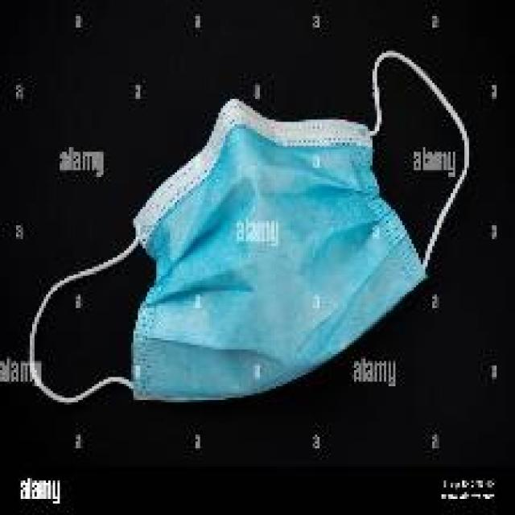

# Roboflow Model Inference

This project demonstrates image classification using a Roboflow model. It processes images, draws bounding boxes, and creates a video of the results.

## Project Structure

- `dataset/input_images/`: Directory for input images.
- `dataset/output_images/`: Directory for processed images and video.
- `roboflow_model_inference.py`: Main script for processing images.

## Dataset

The dataset used in this project is sourced from the [Classification Waste Dataset](https://universe.roboflow.com/gkhang/classification-waste) on Roboflow Universe. This dataset includes various classes such as biodegradable, cardboard, glass, gloves, masks, medicines, metal, paper, plastic, and syringe.

## Setup

1. Clone the repository:
   ```bash
   git clone https://github.com/Harshal1917/Roboflow-Model-Inference.git
   cd roboflow_model_inference
   ```

2. Install the required dependencies:
   ```bash
   pip install -r requirements.txt
   ```

3. Place your input images in the `dataset/input_images/` directory.

## Usage

Run the script to process images and create a video:
```bash
python ImageInference.py
```

## Results

Processed images and the output video will be saved in the `dataset/output_images/` directory.

### Example Input and Output

Below are examples of input images and their corresponding output images processed by the model. The output images include bounding boxes and labels indicating the detected class and confidence percentage.

#### Input and Output Images

<div style="display: flex; flex-wrap: wrap; gap: 20px;">

  <div style="flex: 1; text-align: center;">
    <strong>Gloves Input</strong><br>
    
  </div>

  <div style="flex: 1; text-align: center;">
    <strong>Masks Input</strong><br>
    
  </div>

</div>

<div style="display: flex; flex-wrap: wrap; gap: 20px; margin-top: 20px;">

  <div style="flex: 1; text-align: center;">
    <strong>Gloves Output</strong><br>
    
  </div>

  <div style="flex: 1; text-align: center;">
    <strong>Masks Output</strong><br>
    
  </div>

</div>

## Acknowledgments

The dataset used in this project is provided by [GKHANG](https://universe.roboflow.com/gkhang/classification-waste) on Roboflow Universe. If you use this dataset in a research paper, please cite it using the following BibTeX:

```bibtex
@misc{
    classification-waste_dataset,
    title = { Classification waste Dataset },
    type = { Open Source Dataset },
    author = { GKHANG },
    howpublished = { \url{ https://universe.roboflow.com/gkhang/classification-waste } },
    url = { https://universe.roboflow.com/gkhang/classification-waste },
    journal = { Roboflow Universe },
    publisher = { Roboflow },
    year = { 2024 },
    month = { oct },
    note = { visited on 2024-10-10 },
}
```